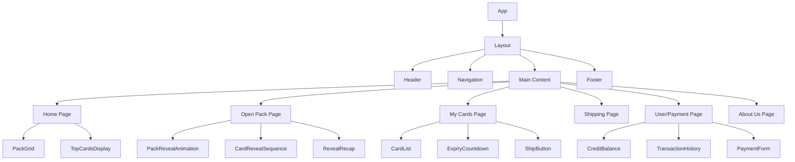
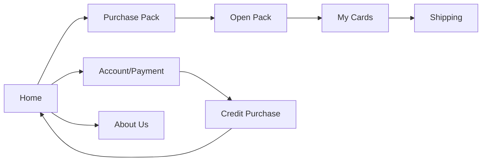
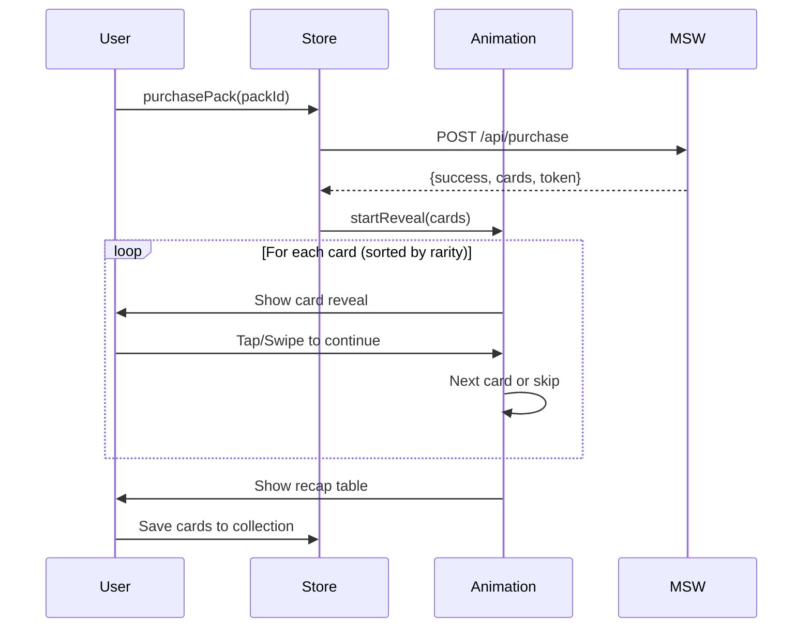

# Card Pack Opening Store - Frontend Design

## Overview

A React + TypeScript frontend application for a digital card pack opening store experience. The application simulates purchasing card packs, opening them with engaging animations, managing collected cards, and handling user transactions. Built as a Single Page Application (SPA) with mock APIs for future backend integration.

### Key Features
- Interactive pack opening with Framer Motion animations
- Card collection with expiry countdown and auto-conversion to credits
- Credit-based purchasing with PayPal payment integration
- Responsive mobile-first design with touch gestures

## Technology Stack & Dependencies

### Core Framework
- **React 18** - Component-based UI framework
- **Vite** - Build tool and development server
- **TypeScript** - Type safety and developer experience

### Styling & Animation
- **Tailwind CSS** - Utility-first CSS framework
- **Framer Motion** - Animation library for pack reveals

### Routing & State
- **React Router v6** - Client-side routing
- **Zustand** - Lightweight state management

### API & Mocking
- **Axios** - HTTP client for API calls
- **MSW (Mock Service Worker)** - API mocking layer

## Component Architecture

### Project Structure
```
src/
├── components/
│   ├── layout/          # Header, Navigation, Footer
│   ├── cards/           # CardDisplay, CardList, TopCardsCarousel
│   ├── packs/           # PackCard, PackGrid, PackRevealAnimation
│   ├── ui/              # Button, Modal, LoadingSpinner, CountdownTimer
│   └── forms/           # PaymentForm, ShippingForm
├── pages/               # Home, OpenPack, MyCards, Shipping, Account, About
├── store/               # Zustand stores (useAppStore, useUserStore)
├── services/            # API service layer with Axios
├── hooks/               # Custom React hooks
├── types/               # TypeScript interfaces and enums
├── mocks/               # MSW handlers and mock data
├── utils/               # Helper functions and constants
└── assets/              # Images, icons, static files
```

### Component Hierarchy



### Core Components Definition

#### Layout Components
- **Header**: Logo, navigation links, user credits display
- **Navigation**: Mobile-friendly navigation with hamburger menu
- **Footer**: Links and company information

#### Pack Components
- **PackCard**: Individual pack display with price and rarity info
- **PackGrid**: Responsive grid layout for available packs
- **PackRevealAnimation**: Main animation component using Framer Motion

#### Card Components
- **CardDisplay**: Individual card with image, name, rarity, and value
- **CardList**: Filterable and sortable card collection view
- **TopCardsCarousel**: Horizontal scrolling top 5 cards display

#### UI Components
- **Button**: Reusable button with variants (primary, secondary, danger)
- **Modal**: Overlay component for confirmations and details
- **LoadingSpinner**: Loading states throughout the app
- **CountdownTimer**: Real-time countdown for card expiry

### Props/State Management

#### Global State (Zustand)
```typescript
interface AppStore {
  user: {
    id: string;
    credits: number;
    profile: UserProfile;
  };
  cards: Card[];
  packs: Pack[];
  transactions: Transaction[];
  
  // Actions
  purchasePack: (packId: string) => Promise<void>;
  openPack: (packId: string) => Promise<Card[]>;
  shipCards: (cardIds: string[]) => Promise<string>;
  updateCredits: (amount: number) => void;
}
```

#### Key Component Interfaces
```typescript
interface PackCardProps {
  pack: Pack;
  onPurchase: (packId: string) => void;
  disabled?: boolean;
  loading?: boolean;
}

interface CardRevealProps {
  cards: Card[];
  onRevealComplete: () => void;
  allowSkip?: boolean;
  currentIndex: number;
}

interface CardListProps {
  cards: Card[];
  onShip: (cardIds: string[]) => void;
  filter?: RarityFilter;
  sortBy?: 'name' | 'rarity' | 'value' | 'expiry';
}
```

## Routing & Navigation

### Route Structure
```typescript
const routes = [
  { path: "/", element: <HomePage /> },
  { path: "/open-pack/:packId", element: <OpenPackPage /> },
  { path: "/my-cards", element: <MyCardsPage /> },
  { path: "/shipping", element: <ShippingPage /> },
  { path: "/account", element: <UserPaymentPage /> },
  { path: "/about", element: <AboutPage /> }
];
```

### Navigation Flow


### Protected Routes
- My Cards, Shipping, Account pages require user authentication
- Redirect to login modal if not authenticated

## Styling Strategy

### Tailwind CSS Configuration
- **Design System**: Custom color palette for card rarities
- **Responsive Breakpoints**: Mobile-first approach
- **Component Classes**: Reusable utility combinations

### Color Scheme
```css
:root {
  --common: #9CA3AF;
  --uncommon: #10B981;
  --rare: #3B82F6;
  --epic: #8B5CF6;
  --legendary: #F59E0B;
  --mythic: #EF4444;
}
```

### Animation Classes
- Framer Motion variants for consistent animations
- Tailwind transitions for hover states and micro-interactions

## State Management

### Zustand Store Structure
```typescript
// stores/useAppStore.ts
const useAppStore = create<AppStore>((set, get) => ({
  user: null,
  cards: [],
  packs: [],
  transactions: [],
  
  purchasePack: async (packId) => {
    // Mock purchase logic
  },
  
  openPack: async (packId) => {
    // Pack opening logic with animation coordination
  }
}));
```

### Local State Management
- Component-level state for UI interactions
- React Hook Form for form validation
- Custom hooks for complex logic abstraction

## API Integration Layer

### API Service Implementation
```typescript
class CardPackApiService {
  private client = axios.create({
    baseURL: '/api',
    timeout: 10000,
    headers: { 'Content-Type': 'application/json' }
  });

  // Products & Packs
  async getProducts(): Promise<Pack[]> {
    const { data } = await this.client.get('/products');
    return data;
  }

  async purchasePack(packId: string, paymentMethod: 'credits' | 'paypal'): Promise<PurchaseResponse> {
    const { data } = await this.client.post('/purchase', { packId, paymentMethod });
    return data;
  }

  // Cards
  async getTopCards(): Promise<Card[]> {
    const { data } = await this.client.get('/cards/top5');
    return data;
  }

  async getUserCards(): Promise<Card[]> {
    const { data } = await this.client.get('/user/cards');
    return data;
  }

  async shipCards(cardIds: string[], address: ShippingAddress): Promise<ShipResponse> {
    const { data } = await this.client.post('/user/ship', { cardIds, address });
    return data;
  }

  // User & Payments
  async getUserProfile(): Promise<User> {
    const { data } = await this.client.get('/user');
    return data;
  }

  async processPayPalPayment(amount: number): Promise<PaymentResponse> {
    const { data } = await this.client.post('/payment/paypal', { amount });
    return data;
  }
}

export const apiService = new CardPackApiService();
```

### MSW Mock Implementation
```typescript
export const handlers = [
  // Products
  rest.get('/api/products', (req, res, ctx) => {
    return res(ctx.delay(500), ctx.json(mockPacks));
  }),
  
  // Pack Purchase
  rest.post('/api/purchase', async (req, res, ctx) => {
    const { packId, paymentMethod } = await req.json();
    const pack = mockPacks.find(p => p.id === packId);
    
    if (!pack) {
      return res(ctx.status(404), ctx.json({ error: 'Pack not found' }));
    }
    
    // Simulate pack opening with random cards
    const revealedCards = generateRandomCards(pack);
    
    return res(
      ctx.delay(800),
      ctx.json({ 
        success: true, 
        packId,
        cards: revealedCards,
        transaction: {
          id: generateId(),
          amount: pack.price,
          method: paymentMethod
        }
      })
    );
  }),
  
  // Top Cards
  rest.get('/api/cards/top5', (req, res, ctx) => {
    const topCards = mockCards
      .sort((a, b) => b.value - a.value)
      .slice(0, 5);
    return res(ctx.json(topCards));
  }),
  
  // User Cards
  rest.get('/api/user/cards', (req, res, ctx) => {
    return res(ctx.json(userCards.filter(card => !card.isExpired)));
  }),
  
  // Shipping
  rest.post('/api/user/ship', async (req, res, ctx) => {
    const { cardIds, address } = await req.json();
    return res(
      ctx.delay(1000),
      ctx.json({ 
        success: true,
        trackingNumber: `HH${Date.now()}`,
        estimatedDelivery: new Date(Date.now() + 7 * 24 * 60 * 60 * 1000)
      })
    );
  }),
  
  // PayPal Payment
  rest.post('/api/payment/paypal', async (req, res, ctx) => {
    const { amount } = await req.json();
    return res(
      ctx.delay(2000),
      ctx.json({ 
        success: true,
        transactionId: `pp_${generateId()}`,
        amount,
        status: 'completed'
      })
    );
  })
];
```

### Error Handling
- Global error boundary for unexpected errors
- API error interceptors with user-friendly messages
- Retry mechanisms for failed requests

## Pack Opening Animation Architecture

### Pack Opening Flow


### Animation States
```typescript
const cardRevealStates = {
  packClosed: { rotateY: 0, scale: 1 },
  packOpening: { rotateY: 180, scale: 1.1 },
  cardEnter: { opacity: 0, y: 100, rotateX: -90 },
  cardVisible: { opacity: 1, y: 0, rotateX: 0 },
  cardExit: { opacity: 0, y: -100, rotateX: 90 }
};
```

### Pack Opening Implementation
```typescript
const PackRevealAnimation: React.FC<PackRevealProps> = ({ 
  cards, 
  onComplete, 
  allowSkip = true 
}) => {
  const [currentIndex, setCurrentIndex] = useState(-1); // -1 = pack closed
  const [isRevealing, setIsRevealing] = useState(false);
  const sortedCards = useMemo(() => 
    cards.sort((a, b) => rarityOrder[a.rarity] - rarityOrder[b.rarity]), 
    [cards]
  );

  const handleRevealNext = () => {
    if (currentIndex < sortedCards.length - 1) {
      setCurrentIndex(prev => prev + 1);
    } else {
      onComplete();
    }
  };

  const handleSkipToRare = () => {
    const rareIndex = sortedCards.findIndex(card => 
      [Rarity.RARE, Rarity.EPIC, Rarity.LEGENDARY, Rarity.MYTHIC].includes(card.rarity)
    );
    setCurrentIndex(rareIndex >= 0 ? rareIndex : sortedCards.length - 1);
  };

  return (
    <div className="pack-reveal-container">
      <AnimatePresence mode="wait">
        {currentIndex === -1 ? (
          <PackOpeningAnimation onComplete={() => setCurrentIndex(0)} />
        ) : (
          <CardRevealComponent 
            card={sortedCards[currentIndex]}
            onNext={handleRevealNext}
            onSkip={allowSkip ? handleSkipToRare : undefined}
          />
        )}
      </AnimatePresence>
    </div>
  );
};
```

### Gesture Handling
- Touch/swipe gestures for mobile card reveals
- Keyboard navigation support
- Skip animation controls

## Data Models & Mock Data

### Core Type Definitions
```typescript
enum Rarity {
  COMMON = 'common',
  UNCOMMON = 'uncommon', 
  RARE = 'rare',
  EPIC = 'epic',
  LEGENDARY = 'legendary',
  MYTHIC = 'mythic'
}

enum Finish {
  NORMAL = 'normal',
  FOIL = 'foil', 
  HOLOGRAPHIC = 'holographic'
}

interface Pack {
  id: string;
  name: string;
  price: number;
  image: string;
  rarity: Rarity;
  cardCount: number;
  guarantees: RarityGuarantee[];
  description?: string;
}

interface Card {
  id: string;
  name: string;
  image: string;
  rarity: Rarity;
  value: number;
  finish: Finish;
  expiryDate: Date;
  isExpired: boolean;
  packId?: string;
}

interface User {
  id: string;
  username: string;
  email: string;
  credits: number;
  joinDate: Date;
  avatar?: string;
}

interface Transaction {
  id: string;
  type: 'purchase' | 'credit_add' | 'shipping' | 'paypal';
  amount: number;
  date: Date;
  status: 'pending' | 'completed' | 'failed';
  details?: any;
}

interface PurchaseResponse {
  success: boolean;
  packId: string;
  cards: Card[];
  transaction: Transaction;
}

interface ShipResponse {
  success: boolean;
  trackingNumber: string;
  estimatedDelivery: Date;
}
```

### Mock Data Examples
```typescript
// Mock Packs Data
export const mockPacks: Pack[] = [
  {
    id: 'starter-pack',
    name: 'Starter Pack',
    price: 100,
    image: '/images/packs/starter.jpg',
    rarity: Rarity.COMMON,
    cardCount: 5,
    guarantees: [
      { rarity: Rarity.UNCOMMON, count: 2 },
      { rarity: Rarity.RARE, count: 1 }
    ],
    description: 'Perfect for beginners'
  },
  {
    id: 'premium-pack', 
    name: 'Premium Pack',
    price: 500,
    image: '/images/packs/premium.jpg',
    rarity: Rarity.RARE,
    cardCount: 10,
    guarantees: [
      { rarity: Rarity.RARE, count: 3 },
      { rarity: Rarity.EPIC, count: 1 }
    ],
    description: 'Higher chance of rare cards'
  }
];

// Mock Cards Data
export const mockCards: Card[] = [
  {
    id: 'dragon-warrior-001',
    name: 'Ancient Dragon Warrior',
    image: '/images/cards/dragon-warrior.jpg', 
    rarity: Rarity.LEGENDARY,
    value: 2500,
    finish: Finish.HOLOGRAPHIC,
    expiryDate: new Date('2024-12-31'),
    isExpired: false
  },
  {
    id: 'fire-mage-002',
    name: 'Fire Mage Apprentice',
    image: '/images/cards/fire-mage.jpg',
    rarity: Rarity.COMMON,
    value: 25,
    finish: Finish.NORMAL,
    expiryDate: new Date('2024-10-15'),
    isExpired: false
  }
];
```

## Page-Specific Architecture

### Home Page
- **PackGrid**: Display available packs with filtering
- **TopCardsCarousel**: Showcase valuable cards
- **FeaturedBanner**: Promotional content
- **QuickStats**: User credits and collection size

### Open Pack Page
- **PackRevealContainer**: Main animation wrapper
- **ProgressIndicator**: Current card position
- **SkipControls**: Fast-forward options
- **RecapModal**: Summary table after completion

### My Cards Page
- **FilterBar**: Rarity, expiry, and value filters
- **CardGrid**: Responsive card layout
- **BulkActions**: Select multiple cards for shipping
- **ExpiryAlerts**: Warnings for soon-to-expire cards

### User/Payment Page
- **ProfileSection**: User information display
- **CreditManagement**: Purchase and usage history
- **PaymentMethods**: PayPal integration mockup
- **TransactionLog**: Detailed transaction history


## Responsive Design Architecture

### Breakpoint Strategy
```css
/* Tailwind breakpoints */
sm: 640px   /* Mobile landscape */
md: 768px   /* Tablet */
lg: 1024px  /* Desktop */
xl: 1280px  /* Large desktop */
```

### Mobile-First Components
- Touch-optimized pack opening gestures
- Swipe navigation for card browsing
- Collapsible navigation menu
- Optimized card grid layouts

### Performance Considerations
- Lazy loading for card images
- Virtual scrolling for large card collections
- Optimized animations for mobile devices
- Progressive Web App capabilities

