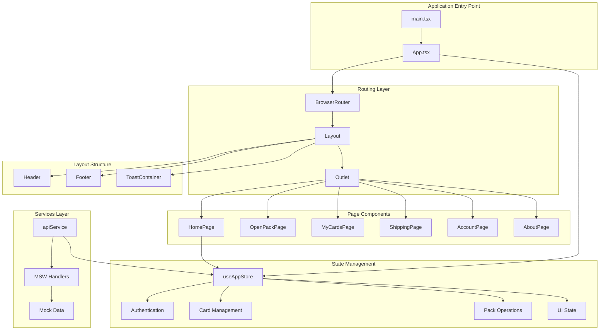
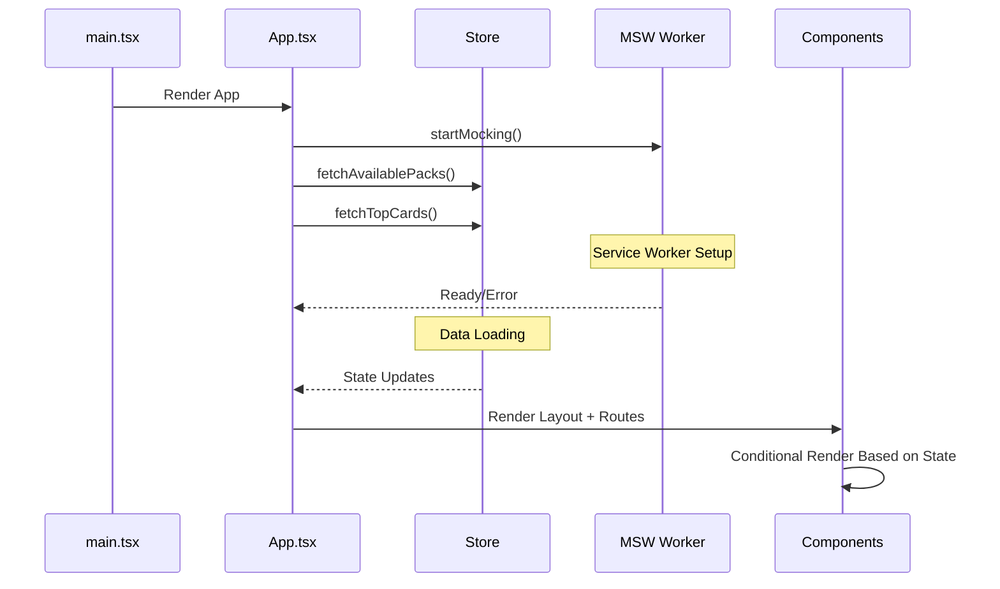
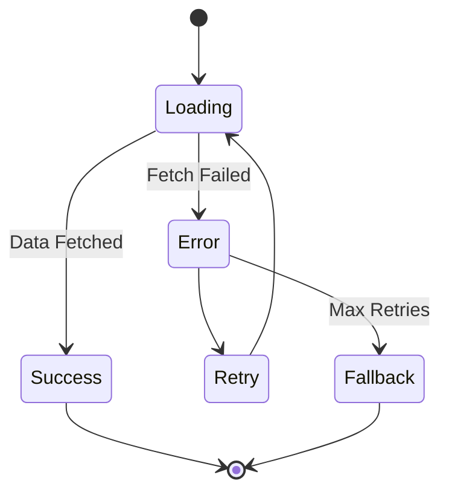
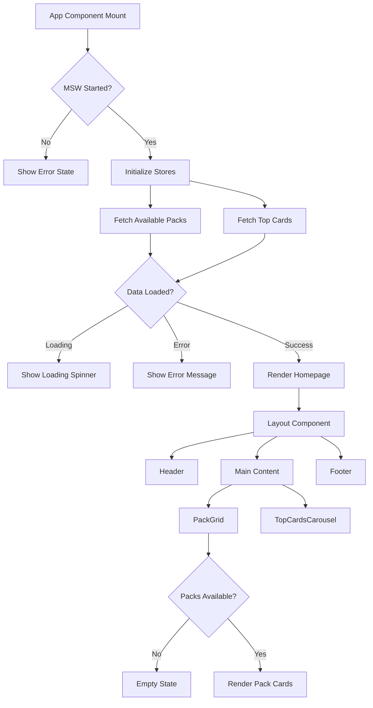

# Page Loading Fix Design

## Overview

This design addresses the blank page issue in the HobbyHunter web MVP application. The application is a React-based card collection platform where users can purchase and open digital card packs, with the ability to ship physical cards. The current implementation faces rendering issues that result in blank pages, requiring systematic debugging and fixes across multiple layers.

## Repository Analysis

**Repository Type**: Frontend Application (React + TypeScript)
**Build Tool**: Vite
**State Management**: Zustand
**Styling**: Tailwind CSS
**Mock API**: MSW (Mock Service Worker)

## Architecture Overview



## Root Cause Analysis

### Potential Issues Identified

1. **CSS Loading Issues**
   - Tailwind CSS import syntax using `@import 'tailwindcss'`
   - Missing base styles causing invisible content
   - Custom CSS variables not properly defined

2. **Component Rendering Issues**
   - Async store initialization blocking render
   - Missing error boundaries
   - Conditional rendering preventing display

3. **MSW Service Worker Issues**
   - Service worker registration failing
   - API calls hanging without fallback
   - Missing `/mockServiceWorker.js` file

4. **State Initialization Issues**
   - Store methods called before component mount
   - Loading states blocking UI render
   - Authentication state conflicts

## Technical Solutions

### 1. CSS and Styling Fixes

**Issue**: Tailwind CSS not loading properly
```mermaid
flowchart LR
    A[index.css] --> B[@import 'tailwindcss']
    B --> C[Tailwind Classes Not Applied]
    C --> D[Invisible Content]
    
    E[Fixed: @import 'tailwindcss/base'] --> F[@import 'tailwindcss/components']
    F --> G[@import 'tailwindcss/utilities']
```

**Solution**: Update CSS imports and add fallback styles
- Fix Tailwind CSS import statements
- Add base body styles with explicit background/text colors
- Ensure custom color variables are properly defined
- Add loading state indicators

### 2. Component Initialization Flow



**Solution**: Implement proper loading sequence
- Add loading states during initialization
- Implement error boundaries for fallback UI
- Ensure components render with minimal data
- Add timeout handling for API calls

### 3. Service Worker Registration

**Issue**: MSW worker not starting properly
```mermaid
graph LR
    A[App.tsx] --> B[startMocking()]
    B --> C{Dev Environment?}
    C -->|Yes| D[worker.start()]
    C -->|No| E[Skip MSW]
    D --> F{Service Worker File Exists?}
    F -->|No| G[Registration Fails]
    F -->|Yes| H[MSW Active]
    G --> I[API Calls Fail]
```

**Solution**: Robust MSW setup
- Verify `/mockServiceWorker.js` exists in public folder
- Add proper error handling for worker registration
- Implement fallback API behavior
- Add development environment checks

### 4. State Management Optimization



**Solution**: Resilient state management
- Initialize store with default data
- Add retry mechanisms for failed requests
- Implement optimistic UI updates
- Separate critical from non-critical data loading

## Implementation Strategy

### Phase 1: CSS and Base Rendering

1. **Fix Tailwind CSS Configuration**
   - Update `index.css` with proper Tailwind imports
   - Add explicit base styles for body and html
   - Verify Tailwind config file content paths

2. **Add Debug Styling**
   - Add visible borders/backgrounds to debug layout
   - Implement loading spinners for async operations
   - Add min-height constraints to prevent collapse

### Phase 2: Component Reliability

1. **Add Error Boundaries**
   - Wrap main App component with error boundary
   - Add fallback UI for component failures
   - Log errors for debugging

2. **Implement Progressive Rendering**
   - Show basic layout before data loads
   - Add skeleton loading states
   - Ensure header/footer always visible

### Phase 3: Service Layer Robustness

1. **MSW Setup Verification**
   - Add service worker file validation
   - Implement graceful degradation without MSW
   - Add development-only console logging

2. **API Fallback Strategy**
   - Add timeout handling for requests
   - Implement retry logic with exponential backoff
   - Provide static fallback data

### Phase 4: Performance Optimization

1. **Lazy Loading Implementation**
   - Code-split route components
   - Defer non-critical data fetching
   - Optimize bundle size

2. **Caching Strategy**
   - Implement client-side data caching
   - Add localStorage persistence for user preferences
   - Optimize re-render cycles

## Component Rendering Flow



## Testing Strategy

### 1. Rendering Tests
- Verify components render without data
- Test loading states display correctly
- Validate error boundaries catch failures

### 2. Integration Tests
- Test MSW worker initialization
- Verify store state updates
- Test navigation between routes

### 3. Visual Regression Tests
- Ensure CSS classes apply correctly
- Verify responsive design works
- Test component visual states

## Risk Mitigation

### High-Risk Areas
1. **Service Worker Registration**: MSW fails in production builds
2. **CSS Framework Loading**: Tailwind styles not applying
3. **Async State Updates**: Components render before data available

### Mitigation Strategies
1. **Environment-Based Fallbacks**: Different behavior for dev/prod
2. **Progressive Enhancement**: Basic functionality without advanced features
3. **Graceful Degradation**: UI works with minimal data

## Monitoring and Debugging

### Development Tools
- React DevTools for component inspection
- Network tab for API call monitoring
- Console logging for state transitions
- MSW DevTools for mock API verification

### Production Monitoring
- Error tracking for component failures
- Performance metrics for load times
- User session recording for UX issues
- API response time monitoring

## Success Metrics

1. **Page Load Success Rate**: > 99%
2. **Time to First Contentful Paint**: < 2 seconds
3. **Component Render Success**: 100% (with fallbacks)
4. **API Mock Response Rate**: 100% in development
5. **User Experience Score**: No blank page reports