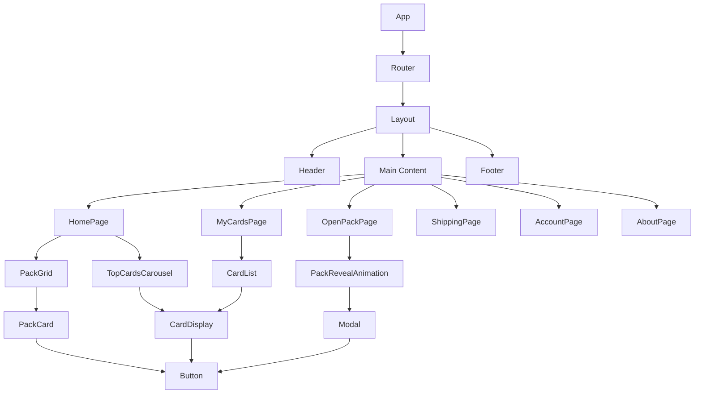
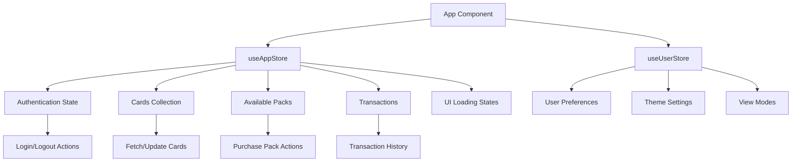
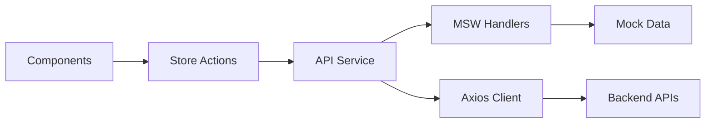

# UI Construction Design - Hobby Hunter Web MVP

## Overview

This document outlines the UI construction strategy for the Hobby Hunter digital card collection platform. The application is a React-based frontend that enables users to purchase virtual card packs, reveal randomized cards, manage collections, and ship physical cards. The UI design focuses on creating an engaging, gamified experience that combines digital collectibles with physical card shipping capabilities.

## Technology Stack & Dependencies

### Core Technologies
- **React 19.1.1** - Modern UI component library with new JSX transform
- **TypeScript 5.8.3** - Type-safe development environment
- **Vite 7.1.2** - Fast build tool and development server
- **React Router DOM 7.9.1** - Client-side routing and navigation

### Styling & Animation
- **Tailwind CSS 4.1.13** - Utility-first CSS framework
- **Framer Motion 12.23.12** - Advanced animations and transitions
- **Autoprefixer 10.4.21** - CSS vendor prefixing

### State & Forms
- **Zustand 5.0.8** - Lightweight state management
- **React Hook Form 7.62.0** - Form handling and validation
- **Yup 1.7.0** - Schema validation

### Development Tools
- **MSW 2.11.2** - Mock Service Worker for API mocking
- **ESLint 9.33.0** - Code linting and quality

## Component Architecture

### Component Hierarchy



### Component Categories

#### 1. Layout Components (`src/components/layout/`)
**Purpose**: Application-wide structural elements

| Component | Responsibility |
|-----------|----------------|
| `Layout.tsx` | Root layout wrapper with routing outlet |
| `Header.tsx` | Navigation, user menu, credits display |
| `Footer.tsx` | Site information and links |

#### 2. Pack Components (`src/components/packs/`)
**Purpose**: Card pack purchase and opening functionality

| Component | Responsibility |
|-----------|----------------|
| `PackGrid.tsx` | Grid layout for available packs |
| `PackCard.tsx` | Individual pack display with purchase action |
| `PackRevealAnimation.tsx` | Animated pack opening sequence |

#### 3. Card Components (`src/components/cards/`)
**Purpose**: Card display and collection management

| Component | Responsibility |
|-----------|----------------|
| `CardDisplay.tsx` | Individual card rendering with rarity styling |
| `CardList.tsx` | Scrollable card collection view |
| `TopCardsCarousel.tsx` | Featured cards carousel display |

#### 4. UI Components (`src/components/ui/`)
**Purpose**: Reusable interface elements

| Component | Responsibility |
|-----------|----------------|
| `Button.tsx` | Styled button with variants and states |
| `Modal.tsx` | Overlay dialog component |
| `Toast.tsx` | Notification messaging |
| `LoadingSpinner.tsx` | Loading state indicator |
| `ProgressBar.tsx` | Progress visualization |
| `CountdownTimer.tsx` | Time-based countdown display |

### Component Design Patterns

#### 1. Container-Presentation Pattern
- **Containers**: Handle state management and business logic
- **Presentations**: Focus on rendering and user interaction
- Example: `PackGrid` (container) manages pack data, `PackCard` (presentation) handles display

#### 2. Compound Component Pattern
- Components work together to form complex interfaces
- Example: `CardList` + `CardDisplay` for collection views

#### 3. Render Props Pattern
- Used for animations and complex state sharing
- Example: `PackRevealAnimation` accepts render functions for customization

## Routing & Navigation

### Route Structure

```mermaid
graph LR
    A[/] --> B[HomePage]
    A --> C[/open-pack/:packId]
    C --> D[OpenPackPage]
    A --> E[/my-cards]
    E --> F[MyCardsPage]
    A --> G[/shipping]
    G --> H[ShippingPage]
    A --> I[/account]
    I --> J[AccountPage]
    A --> K[/about]
    K --> L[AboutPage]
```

### Navigation Features
- **Nested Routing**: All routes nested under Layout component
- **Dynamic Routes**: Pack opening with dynamic pack ID parameter
- **Protected Routes**: Account and shipping pages require authentication
- **Breadcrumb Navigation**: Implemented in Header component

## Styling Strategy

### Tailwind CSS Configuration

#### Design System Tokens
- **Colors**: Custom card rarity colors (common, uncommon, rare, epic, legendary)
- **Spacing**: Consistent 8px grid system
- **Typography**: Hierarchical font sizes and weights
- **Breakpoints**: Mobile-first responsive design

#### Component Styling Approach
```typescript
// Button variants using Tailwind classes
const buttonVariants = {
  primary: "bg-blue-600 hover:bg-blue-700 text-white",
  secondary: "bg-gray-200 hover:bg-gray-300 text-gray-800",
  danger: "bg-red-600 hover:bg-red-700 text-white"
}
```

#### Animation Integration
- **Framer Motion**: Used for pack opening animations and page transitions
- **CSS Transitions**: Applied to hover states and micro-interactions
- **Transform Animations**: Card flip effects and reveal sequences

## State Management

### Zustand Store Architecture



### State Structure

#### useAppStore (Global Application State)
```typescript
interface AppState {
  // Authentication
  user: User | null;
  isAuthenticated: boolean;
  
  // Collections
  userCards: Card[];
  availablePacks: Pack[];
  topCards: Card[];
  
  // Transactions
  recentTransactions: Transaction[];
  
  // UI State
  isLoading: boolean;
  notifications: Toast[];
}
```

#### useUserStore (Persistent User Preferences)
```typescript
interface UserState {
  theme: 'light' | 'dark';
  cardViewMode: 'grid' | 'list';
  soundEnabled: boolean;
  animationsEnabled: boolean;
}
```

### Component Integration Patterns

#### 1. Store Subscription
```typescript
const MyComponent = () => {
  const { userCards, fetchCards } = useAppStore();
  const { cardViewMode } = useUserStore();
  
  return (
    <CardList 
      cards={userCards} 
      viewMode={cardViewMode}
      onRefresh={fetchCards}
    />
  );
};
```

#### 2. Action Dispatching
```typescript
const PackCard = ({ pack }) => {
  const { purchasePack, isLoading } = useAppStore();
  
  const handlePurchase = async () => {
    await purchasePack(pack.id);
    // Navigate to pack opening page
  };
  
  return (
    <Button 
      onClick={handlePurchase}
      disabled={isLoading}
    >
      Purchase Pack
    </Button>
  );
};
```

## API Integration Layer

### Service Architecture



### API Service Structure
```typescript
// apiService.ts
class ApiService {
  async fetchPacks(): Promise<Pack[]>
  async purchasePack(packId: string): Promise<Transaction>
  async openPack(packId: string): Promise<Card[]>
  async fetchUserCards(): Promise<Card[]>
  async shipCards(cardIds: string[]): Promise<ShippingRequest>
}
```

### Mock Service Worker (MSW) Integration
- **Development Environment**: MSW intercepts API calls
- **Response Simulation**: Realistic latency and error simulation
- **Data Persistence**: Browser session storage for mock data
- **Handler Organization**: Organized by feature domain

## Testing Strategy

### Component Testing Approach

#### 1. Unit Testing
- **UI Components**: Props, state, and user interactions
- **Hooks**: Custom hooks for gestures and animations
- **Utilities**: Animation helpers and formatters

#### 2. Integration Testing
- **Store Integration**: Component-store interactions
- **Routing**: Navigation and route protection
- **API Integration**: Service layer and mock responses

#### 3. Visual Testing
- **Storybook Integration**: Component showcase and documentation
- **Snapshot Testing**: Prevent visual regressions
- **Responsive Testing**: Cross-device compatibility

### Testing Technologies
- **Jest**: Unit and integration testing framework
- **React Testing Library**: Component testing utilities
- **MSW**: API mocking for tests
- **Cypress**: End-to-end testing (planned)

## User Experience Patterns

### Interaction Design

#### 1. Card Collection Experience
- **Grid/List Toggle**: User preference for viewing cards
- **Filtering & Sorting**: By rarity, date, value
- **Search Functionality**: Find specific cards
- **Bulk Actions**: Select multiple cards for shipping

#### 2. Pack Opening Gamification
- **Animation Sequence**: Multi-stage reveal animation
- **Sound Effects**: Audio feedback for pack opening
- **Rarity Indication**: Visual cues for card rarity
- **Collection Progress**: Track set completion

#### 3. Credit System Integration
- **Balance Display**: Always visible in header
- **Purchase Flow**: Seamless credit spending
- **Transaction History**: Clear spending tracking
- **Low Balance Warnings**: Proactive notifications

### Responsive Design Strategy

#### Breakpoint System
| Device | Breakpoint | Layout Strategy |
|--------|------------|-----------------|
| Mobile | < 640px | Single column, stack navigation |
| Tablet | 640px - 1024px | Two column, collapsible sidebar |
| Desktop | > 1024px | Multi-column, full navigation |

#### Mobile-First Optimizations
- **Touch Targets**: Minimum 44px touch areas
- **Gesture Support**: Swipe navigation for carousels
- **Performance**: Lazy loading for card images
- **Offline Support**: Cache critical UI components

## Performance Optimization

### Loading Strategies

#### 1. Code Splitting
- **Route-based Splitting**: Each page loads independently
- **Component Lazy Loading**: Heavy components load on demand
- **Dynamic Imports**: Animation libraries loaded when needed

#### 2. Asset Optimization
- **Image Lazy Loading**: Cards load as they enter viewport
- **Progressive Enhancement**: Base experience without JavaScript
- **Bundle Analysis**: Monitor bundle size and dependencies

#### 3. State Optimization
- **Selective Re-renders**: Zustand prevents unnecessary updates
- **Memoization**: Expensive calculations cached
- **Virtual Scrolling**: Large card collections efficiently rendered

### Animation Performance
- **GPU Acceleration**: Transform and opacity animations
- **Reduced Motion**: Respect user accessibility preferences
- **Animation Queuing**: Prevent animation conflicts
- **Frame Rate Monitoring**: Maintain 60fps target